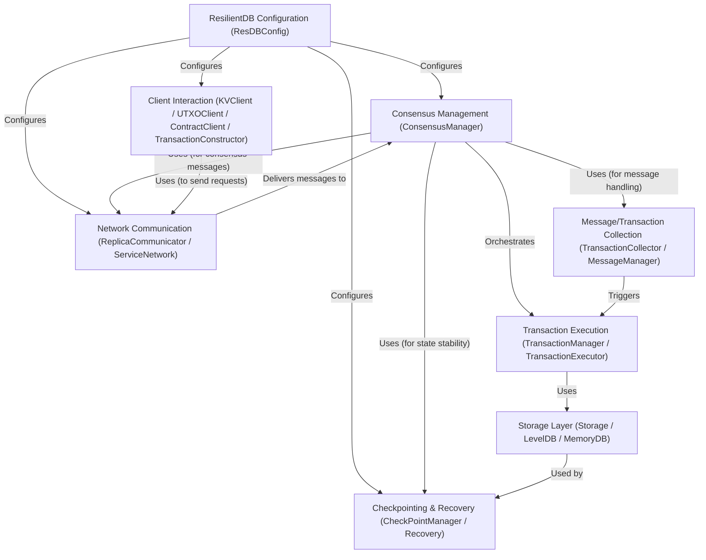

# Tutorial: incubator-resilientdb

ResilientDB (incubator-resilientdb) is a **fault-tolerant** distributed database system.
It uses multiple server copies (*replicas*) that communicate over a network to agree on the correct order of operations (transactions).
This agreement process, called **consensus** (often using PBFT), ensures that the database remains *consistent and available* even if some replicas crash or behave incorrectly.
External applications interact with the database through **client libraries** to store and retrieve data reliably.

**Source Repository:** [None](None)

## Chapters

1. [Client Interaction (KVClient / UTXOClient / ContractClient / TransactionConstructor)](01_client_interaction__kvclient___utxoclient___contractclient___transactionconstructor_.md)
2. [Network Communication (ReplicaCommunicator / ServiceNetwork)](02_network_communication__replicacommunicator___servicenetwork_.md)
3. [Consensus Management (ConsensusManager)](03_consensus_management__consensusmanager_.md)
4. [Message/Transaction Collection (TransactionCollector / MessageManager)](04_message_transaction_collection__transactioncollector___messagemanager_.md)
5. [Transaction Execution (TransactionManager / TransactionExecutor)](05_transaction_execution__transactionmanager___transactionexecutor_.md)
6. [Storage Layer (Storage / LevelDB / MemoryDB)](06_storage_layer__storage___leveldb___memorydb_.md)
7. [Checkpointing & Recovery (CheckPointManager / Recovery)](07_checkpointing___recovery__checkpointmanager___recovery_.md)
8. [ResilientDB Configuration (ResDBConfig)](08_resilientdb_configuration__resdbconfig_.md)

---

Generated by [AI Codebase Knowledge Builder](https://github.com/The-Pocket/Tutorial-Codebase-Knowledge)